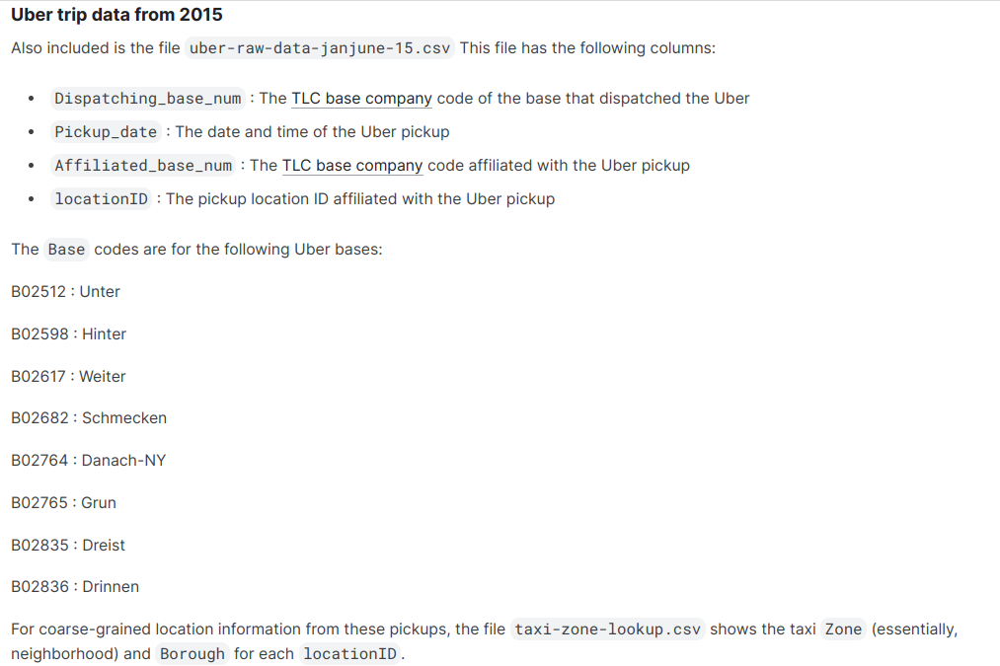
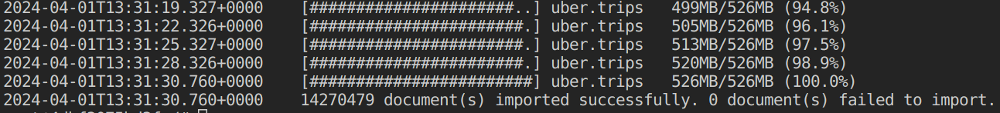

# MongoDB

## Установка MongoDB

```bash
    docker run --name mipt-mongodb -d -p 27017:27017 \
        -v db_data:/data/db \
        -v db_dataset:/data/dataset \
        mongo 
```

## Данные

Данные были взяты [по данной ссылке](https://www.kaggle.com/datasets/fivethirtyeight/uber-pickups-in-new-york-city/data): датасет "Uber trip data from 2015", ~15млн записей.

Описание: 

Данный датасет не включен в Git репозиторий, т.к занимает 500МБ. Для повтора указанных действий, необходимо поместить файл *uber-raw-data-janjune-15.csv* внутрь директории *dataset/*.

### Mongoimport

Для популяции БД использовалась утилита mongoimport:

```bash
    docker cp ./dataset/uber-raw-data-janjune-15.csv mipt-mongodb:/data/dataset/uber-raw-data-janjune-15.csv

    docker exec -it mipt-mongodb bash

    mongoimport --db uber --collection trips --type csv --file /data/dataset/uber-raw-data-janjune-15.csv --headerline
```

Результат:



## Работа с БД

### Подключение к нужной базе

Входим в Mongo Shell:

```bash
    $ mongosh
```

Все дальнейшие команды выполнены внутри Mongosh.

Выбираем базу с данным uber: 

```bash
    use uber;
```

### Операции внутри БД

#### Выборка

```js
    // 50 элементов с locationID < 100
    db.trips.find({ locationID: { $lt: 100 }}).limit(50);

    // элементы с locationID > 100 и Dispatching_base_num == 'B02598'
    db.trips.find({ 
        locationID: { $gt: 100 },
        Dispatching_base_num: { $eq: 'B02598' }
    });

    // EXPLAIN предыдущего запроса
    db.trips.explain().find({ 
        locationID: { $gt: 100 },
        Dispatching_base_num: { $eq: 'B02598' }
    });

    /* Поиск максимального времени подбора пассажира в locationID 141,
    сгруппированных по Dispatching_base_num.
    Результат отсортирован в порядке убывания по дате.
    */
    db.trips.aggregate([
        { $match: { locationID: 141 } },
        { $group: { _id: "$Dispatching_base_num", maxPickupData: { $max: "$Pickup_date" }}},
        { $sort: { maxPickupData: -1 } }
    ]);

    // Запрос выше занимает значительное количество времени, поэтому проанализируем его с помощью EXPLAIN:

    db.trips.explain().aggregate([
        { $match: { locationID: 141 } },
        { $group: { _id: "$Dispatching_base_num", maxPickupData: { $max: "$Pickup_date" }}},
        { $sort: { maxPickupData: -1 } }
    ]);

    // Поиск по locationID требует COLLSCAN. Добавим соответствующий индекс:

    db.trips.createIndex({ locationID: 1 });

    /* Ура, теперь наш поиск использует IXSCAN, если проверить через EXPLAIN. 
    Запустив запрос снова, скорость работы увеличивается значительно - нет задержки, от слова совсем.
    */
```

#### Обновление

```js
    // Конвертируем дату подбору к "правильному" типу: из текста в дату:
    db.trips.updateMany(
        {},
        [{ $set: { "Pickup_date": { $toDate: "$Pickup_date" } }}]
    );

    // Проверим:
    db.trips.findOne({});
    // Как можно увидеть, поле выводится с припиской ISODate

    // Забавы ради, увеличим locationID у поездок с Dispatching_base_num == B02682 на 500.
    db.trips.updateMany(
        { Dispatching_base_num: { $eq: 'B02682'}},
        { $inc: { locationID: 500 } }
    );

    // Проверим результат:
    db.trips.find({ Dispatching_base_num: { $eq: 'B02682'} });
    // Значения увеличились!

    // На последок, удалим колонку с датами:
    db.trips.updateMany({}, { $unset : {"Pickup_date": 1} });

    // Проверим:
    db.trips.findOne({});
    // Поле пропало.
```

#### Удаление

```js
    // Удалим все поездки Dispatching_base_num == 'B02617'
    db.trips.deleteMany({ "Dispatching_base_num": { $eq: 'B02617'} });

    // Проверим, осталось ли что-то:
    db.trips.countDocuments({ "Dispatching_base_num": { $eq: 'B02617'} });
    // Как и ожидалось - 0.

    // Удалим документы по двум условиям:
    db.trips.deleteMany({
        "Affiliated_base_num": { $eq: 'B02789' },
        "locationID": { $lt: 100 }
    });
    // ~12000 документов удалилось.

    // И, напоследок, почистим всю коллекцию целиком.
    db.trips.deleteMany({});

    // Проверим:
    db.trips.countDocuments({});
    // 0.
```

Конец.