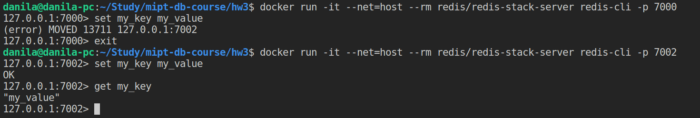

# Redis Cluster

## Тестовые данные 

В качестве данных был использован JSON-файл(~25MB) доступный по ссылке: <https://github.com/json-iterator/test-data/blob/master/large-file.json>. 

## Развертывание Redis

Для начала, Redis был развернут в Docker:

```bash
    # Запуск Redis в Docker
    docker run --name mipt-redis -p 6379:6379 -d redis/redis-stack-server:latest
```

Был взят образ `redis/redis-stack-server`, а не стандартный `redis` для того, чтобы был включен модуль RedisJSON, который позволяет сохранять JSON и обращаться к его полям напрямую.

## Взаимодействие с Redis

Все взаимодействие с Redis построено с помощью JavaScript и соответствующей библиотеки node-redis.

Для установки зависимостей потребуется npm:

```bash
    npm i
```

Далее, я подготовил специальный скрипт, позволяющий работать с тестовыми данными, сохраняя их в разных форматах: JSON, HSET, ZSET, LIST.

Для его использования необходимо запустить:

```bash
    npm run script <command>
```

Здесь в качестве command нужно передать один из аргументов: json, hset, zset или list.

## Сохранение и работы с данными

Наиболее пригодный формат данных для работы с JSON, который предоставляет Redis, как ни странно, JSON. Начнем с него.

### JSON

Команда для тестирования функционала:

```bash
    npm run script json
```

На моем ПК вставка JSON в Redis занимает ~200ms.


Чтение из JSON по заданному пути - 1ms.


Основные использованный команды в данном пункте(подробнее в index.js):

```js
    await client.json.set(MAIN_KEY, "$", data);
    await client.json.get(MAIN_KEY, { path: ["[0].repo"] });
    await client.json.get(MAIN_KEY, { path: ["[1000].id", "[2000].actor.id"] });
```

Почему все под одним ключом?

Потому что Redis позволяет так сделать. В случае необходимости, можно проиндексировать данные внутри Redis и затем пользоваться SQL-like индексным поиском и строить сложные запросы с фильтрацией. Думаю, внутри данного задания не расмотреть данный вопрос - необязательно.

### HSET

Команда для тестирования функционала:

```bash
    npm run script hset
```

На моем ПК вставка в виде HSET занимает ~500ms. Значительно дольше, чем при сохранении в JSON формате. Скорее всего дело в том, что необходимо преобразовать данные в нужный формат внутри JS, в то время как RedisJSON позволяет сократить накладные расходы.


Чтение из HSET по ID - 1ms.


Основные использованный команды в данном пункте(подробнее в index.js):

```js
    await client.hSet(`${MAIN_KEY}:${hashKey}`, fieldValues);
    await client.hGetAll(`${MAIN_KEY}:2489651105`);
```

В JS-файле можно подробнее ознакомиться с тем, как изначальный JSON приводился к тому формату, чтобы можно было вставить все данные в виде HSET. В качестве основного ключа используется id события.

### ZSET

Команда для тестирования функционала:

```bash
    npm run script zset
```

На моем ПК вставка в виде ZSET занимает ~450ms. Так как ZSET подразумевает, что элементы должны сортироваться по какому-то полю, то я выбрал created_at. Таким образом, события сохранены от более старых к новым.


Чтение из ZSET по диапазону значений - 1ms.


Основные использованный команды в данном пункте(подробнее в index.js):

```js
    await client.zAdd(MAIN_KEY, { score, value: JSON.stringify(obj) });
    await client.zRangeByScore(MAIN_KEY, "-inf", 1420124405000);
    await client.zRange(MAIN_KEY, 0, 10);
```

### LIST

Команда для тестирования функционала:

```bash
    npm run script list
```

На моем ПК вставка в виде LIST занимает ~420ms.


Чтение по диапазону, right и left POP занимают ~1ms.


Основные использованный команды в данном пункте(подробнее в index.js):

```js
    await client.lPush(MAIN_KEY, JSON.stringify(obj));
    await client.lRange(MAIN_KEY, 0, 10);
    await client.lPop(MAIN_KEY);
    await client.rPop(MAIN_KEY);
```

## Кластер

Кластер будет развертываться с помощью Docker Compose. См. `docker-compose.yml`.

Все согласно инструкции:  <https://redis.io/docs/latest/operate/oss_and_stack/management/scaling/>

Для начала, запускаем 6 контейнеров с Redis:

```bash
    docker compose up -d
```

Затем в логах контейнеров можно увидеть следующее:


Кластер еще не готов, нужно его инициализировать:

```bash
    docker run -it --net=host --rm redis/redis-stack-server redis-cli --cluster create 127.0.0.1:7000 127.0.0.1:7001 127.0.0.1:7002 127.0.0.1:7003 127.0.0.1:7004 127.0.0.1:7005 --cluster-replicas 1
```


Теперь готово. Через Redis CLI можем проверить с помощью команды `cluster nodes`:


Так как каждая мастер нода взяла определенное число слотов, то теперь мы видим, что при вставке ключей мы можем быть перенаправленны на нужную ноду и сохранить ключ там.



В данном примере при попытке сохранить `my_key` на ноде :7000 мы получаем сообщение, что данный ключ должен быть сохранен на :7002. При попытке сделать это - все успешно.

Таким образом, кластер работает.

Почему он отказоустойчив?

Мы подняли 6 Redis серверов, однако 3 из них master и 3 slave. В случае падения одного из master его работу перехватывает slave. При наличии трех разных нод, мы можем расположить Redis сервера в такой топологии:

1. Node 1: Master 1, Slave 2
2. Node 2: Master 2, Slave 3
3. Node 3: Master 3, Slave 1

Таким образом, при выходе из строя одной из Node, кластер продолжит свою работу. При этом, роль Master N отойдет к Slave N на другой Node.

В своем примере, я остановил один из контейнеров и роль master перешла к соответствующему slave.


