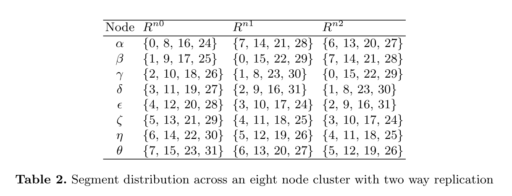
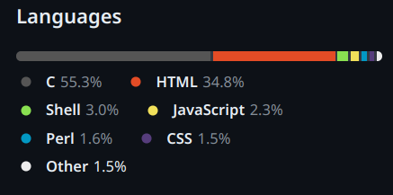
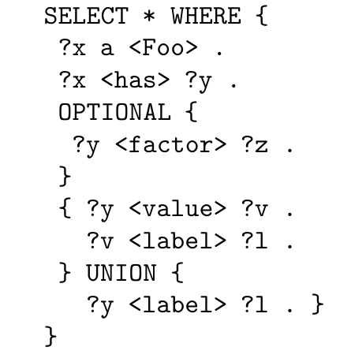
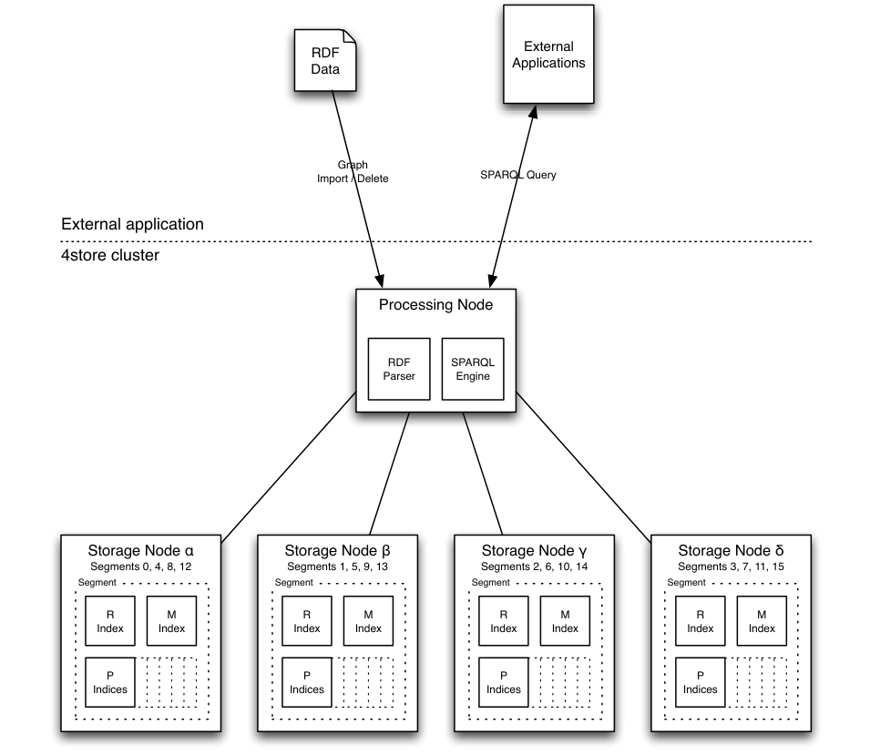

# 4store

### История развития СУБД

Перед тем, как перейти непосредственно к самому 4store, рассмотрим тип данных, с которым он работает - Resource Description Framework(RDF).

RDF — это разработанная W3C модель для представления данных, в особенности — метаданных. RDF представляет собой утверждение, пригодное для машинной обработки. Типичная запись в RDF представляет собой триплет: "Субъект - Предикат - Объект".

Сама же СУБД 4 store была разработана Стивом Харрисом в компании Garlic для поддержки их веб-приложений.

### Инструменты для взаимодействия с СУБД

Для взаимодействия с СУБД для начала необходимы Git, GNU Autoconf, GNU libtools и куча других Linux-библиотек, чтобы попытаться запустить СУБД.

Отдельно стоит выделить Raptor - RDF-парсер и Rasqal - SPARQL-парсер, которые так же нужно ставить из исходников.

### Какой database engine используется в вашей СУБД?

В 4store используется собственный графовый движок, который специально разработан для работы с RDF данными. Этот движок оптимизирован для хранения, запросов и обработки RDF графов, что делает его эффективным инструментом для работы с семантическими данными.

### Как устроен язык запросов в вашей СУБД? Разверните БД с данными и выполните ряд запросов. 

Язык запросов построен на языке [SPARQL](https://www.w3.org/TR/rdf-sparql-query/). 

### Распределение файлов БД по разным носителям?

4store позволяет распределять данные по разным носителям и поддерживает как репликацию, так и шардинг.

Как пример, распределение сегментов по разным нодам с коэффициентом репликации 2:

### На каком языке/ах программирования написана СУБД?

СУБД написана на языке C.

### Какие типы индексов поддерживаются в БД? Приведите пример создания индексов.

4store хранит данные в виде кортежа из 4 элементов: (model, subject, predicate, object). На каждый из элементов автоматически создается индекс, что ускоряет дальнейший поиск. В качестве структур данных, поддерживающих индекс, используются сжатое префиксное дерево(radix tree), хэш-таблицы. Вручную создавать ничего не требуется.

### Как строится процесс выполнения запросов в вашей СУБД?

Процесс запросов 4store построен на Реляционной Алгебре, конкретнее на языке запросов SPARQL.

На основе запроса на языке SPARQL строится синтаксическое дерево с помощью инструмента Rasqual. 

Далее 4store обходит это дерево в поисках вхождений переменных, которые он записывает как метаданные, и помечает блоки шаблонов связывания идентификаторами. 

Кроме того, он записывает, какие блоки соединяются с другими блоками и с помощью какой операции.

Следующий этап сворачивает все выражения UNION. Блоки UNION сворачиваются снизу вверх, сначала оцениваются все выражения FILTER и удаляются строки, не удовлетворяющие требованиям, затем объединяются таблицы связей для совместных UNION.

Затем выполняется объединение оставшихся блоков.

Наконец, применяются все оставшиеся фильтры, ORDER BY и DISTINCT.Фильтры следует применять как можно позже, чтобы избежать необходимости разрешать больше RID чем требуется. 

### Есть ли для вашей СУБД понятие «план запросов»? Если да, объясните, как работает данный этап.

Да, см. ответ выше.

### Поддерживаются ли транзакции в вашей СУБД? Если да, то расскажите о нем. Если нет, то существует ли альтернатива?

Нет, в 4store нет транзакций. Причиной тому послужило отстутствие бизнес-требований. Аналогов также нет.

### Какие методы восстановления поддерживаются в вашей СУБД. Расскажите о них.

В 4store хорошо приживается реплицирование, так что это является одним из способов "профилактики" выхода из строя тех или иных узлов.

Нет сложности и в том, чтобы сделать бэкап базы. В [Git репозитории](https://github.com/4store/4store/tree/master/src/utilities) лежат скрипты для запуска данного процесса.

### Расскажите про шардинг в вашей конкретной СУБД. Какие типы используются? Принцип работы.

4store поддерживается шардинг. Данные распределяются по сегментам, которые могут быть в дальнейшем расположены на разных узлах. Каждому узлу присвается некоторое число сегментов, за которые он ответственнен.

Номер сегмента, в который попадет очередной набор данных, считается по формуле:
`segment = rid(subject) mod segments`.

RID выступает хэш функцией, которая возвращает некое целое число для набора данных.

### Возможно ли применить термины Data Mining, Data Warehousing и OLAP в вашей СУБД?

Можно представить следующие вариации использования 4store в качестве Data Mining, Data Warehousing и OLAP.

Data Warehousing: В RDF Data Warehouse может быть представлен в виде графа RDF, содержащего объединенные данные из различных источников. 4store может использоваться для хранения таких графов данных и предоставлять средства для запросов и анализа этой информации.

Data Mining: Анализ данных в контексте RDF может включать в себя обнаружение шаблонов, тенденций и связей в графе RDF. 4store может быть использован для выполнения запросов и извлечения таких шаблонов из RDF данных.

OLAP: OLAP в контексте RDF может включать в себя анализ данных с использованием SPARQL запросов для исследования структуры и связей в RDF графах. 4store может обеспечить быстрый доступ к данным и выполнение сложных аналитических запросов для OLAP анализа.

### Какие методы защиты поддерживаются вашей СУБД? Шифрование трафика, модели авторизации и т.п.

При коммуникации узлов между собой можно использовать авторизацию по общему паролю. Соединения однако остаются незашифрованными, т.к это замедляет скорость работы.

### Какие сообщества развивают данную СУБД? Кто в проекте имеет права на коммит и создание дистрибутива версий? Расскажите об этих людей и/или компаниях.

С данной БД ничего не происходит, и последний коммит был сделан практически 10 лет назад. С прошлыми контрибьюторами можно ознакомится в [GitHub](https://github.com/4store/4store/graphs/contributors).

Основная компания, для которой и делалась данная СУБД - Garlik. Судя по всему, данной компании уже не существует.

### Создайте свои собственные данные для демонстрации работы СУБД. 

### Как продолжить самостоятельное изучение языка запросов с помощью демобазы. Если демобазы нет, то создайте ее.

Для изучения языка запросов можно воспользоваться следующими ресурсами:

1. https://github.com/dajobe/rasqal
2. https://www.w3.org/TR/rdf-sparql-query/

### Где найти документацию и пройти обучение

Два источника: [GitHub](https://github.com/4store/4store) и научная статья, написанная авторами 4store: ["4store: The design and implementation of a clustered RDF store"](https://www.researchgate.net/publication/228370442_4store_The_design_and_implementation_of_a_clustered_RDF_store).

### Как быть в курсе происходящего

С данной БД ничего не происходит, и последний коммит был сделан практически 10 лет назад, следить не за чем.